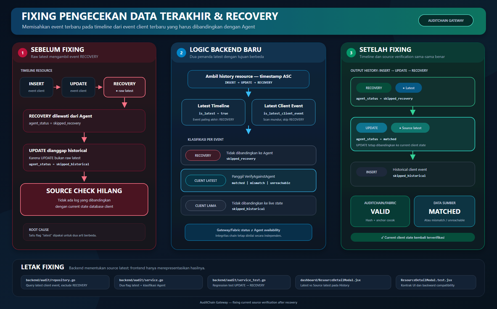

# Fixing Pengecekan Data Terakhir dan Recovery

Dokumen ini menjelaskan perbaikan pemilihan log yang dibandingkan dengan current state database client setelah AuditChain membuat event `RECOVERY`.



Versi vektor yang dapat diperbesar atau diedit tersedia di [`fixing_pengecekandata_terakhir-dan-recovery.svg`](./fixing_pengecekandata_terakhir-dan-recovery.svg).

## Ringkasan masalah

Sebelum perbaikan, backend memakai satu pengertian `latest` untuk dua kebutuhan berbeda:

1. event paling baru pada timeline AuditChain; dan
2. event operasional client terbaru yang harus dibandingkan dengan data live melalui Agent.

Pada urutan berikut:

```text
INSERT → UPDATE → RECOVERY
```

backend melakukan hal berikut:

- `RECOVERY` dianggap sebagai log terbaru;
- `RECOVERY` tidak diperiksa ke Agent karena merupakan event internal Gateway;
- `UPDATE` dianggap historical karena bukan log paling akhir;
- `UPDATE` juga tidak diperiksa ke Agent;
- tidak ada log yang dibandingkan dengan current state database client.

Akibatnya, setelah recovery berhasil, sistem kehilangan pengecekan sumber walaupun masih ada `UPDATE`, `INSERT`, atau `DELETE` client yang seharusnya menjadi pembanding terakhir.

## Prinsip perbaikan

Perbaikan memisahkan dua status terbaru:

| Field | Makna |
|---|---|
| `is_latest` | Event paling baru secara kronologis pada timeline AuditChain. Event ini dapat berupa `RECOVERY`. |
| `is_latest_client_event` | Event operasional client terbaru yang boleh dibandingkan dengan current state database melalui Agent. |

Event yang dianggap sebagai client event adalah `INSERT`, `UPDATE`, dan `DELETE`. Event `RECOVERY` dikecualikan karena dibuat oleh AuditChain Gateway, bukan oleh database operasional client.

## Flow setelah perbaikan

Untuk setiap resource, backend menjalankan alur berikut:

1. Mengambil seluruh history resource dengan urutan timestamp menaik.
2. Menandai item terakhir sebagai `is_latest=true` untuk kebutuhan timeline.
3. Melakukan scan mundur dan melewati seluruh event `RECOVERY`.
4. Menandai event client pertama yang ditemukan sebagai `is_latest_client_event=true`.
5. Menjalankan pemeriksaan kriptografi PostgreSQL/Fabric pada seluruh log.
6. Menjalankan pemeriksaan Agent hanya pada `is_latest_client_event=true`.
7. Mengembalikan status Agent secara terpisah dari status integritas Gateway/Fabric.

Status Agent yang digunakan:

| Status | Arti |
|---|---|
| `matched` | Agent dapat dihubungi dan data sumber cocok dengan event client terbaru. |
| `mismatch` | Agent dapat dihubungi, tetapi data sumber berbeda. |
| `unreachable` | Agent tidak dapat dihubungi atau request gagal. Ini bukan bukti log AuditChain rusak. |
| `not_configured` | Client belum memiliki konfigurasi Agent yang dapat digunakan. |
| `skipped_recovery` | Event merupakan `RECOVERY` internal Gateway dan tidak relevan dibandingkan ke Agent. |
| `skipped_historical` | Event client sudah historis dan tidak lagi merepresentasikan kondisi sumber terkini. |

## Letak perubahan

### Backend: repository audit

File: [`internal/modules/audit/repository.go`](../../auditchain-gateway-backend/internal/modules/audit/repository.go)

Perubahan:

- menambahkan `GetLatestClientLogByResource()`;
- query mengambil event terbaru untuk resource dan tenant yang sama;
- query menggunakan `UPPER(TRIM(action)) <> 'RECOVERY'` agar event recovery tidak mengambil posisi latest client event;
- method ini digunakan oleh verifikasi manual untuk menentukan apakah log yang dipilih masih merupakan current client event.

Alasan:

`GetLatestLogByResource()` tetap diperlukan untuk kebutuhan latest timeline dan tidak boleh diubah semantiknya. Karena itu dibuat method terpisah agar kontrak lama tidak rusak.

### Backend: service audit

File: [`internal/modules/audit/service.go`](../../auditchain-gateway-backend/internal/modules/audit/service.go)

Perubahan utama:

- menambahkan `IsLatestClientEvent` pada `ResourceLogVerification` dengan JSON field `is_latest_client_event`;
- `VerifyResourceHistory()` menghitung `lastIndex` dan `latestClientIndex` secara terpisah;
- `latestClientEventIndex()` melakukan scan mundur dan melewati event recovery;
- `classifyResourceLog()` menerima dua flag: latest timeline dan latest client event;
- `isRecoveryAction()` menangani variasi casing dan spasi pada action recovery;
- `client_mismatch` hanya dilekatkan pada latest client event;
- verifikasi manual menggunakan `GetLatestClientLogByResource()`;
- verifikasi manual terhadap event recovery menghasilkan `skipped_recovery` tanpa menghubungi Agent.

Alasan:

Timeline AuditChain dan kondisi live database client adalah dua domain berbeda. Recovery sah sebagai event timeline terbaru, tetapi tidak merepresentasikan perubahan pada database client.

### Backend: regression test

File: [`internal/modules/audit/service_test.go`](../../auditchain-gateway-backend/internal/modules/audit/service_test.go)

Case yang diuji:

- `UPDATE → RECOVERY`: `UPDATE` tetap menjadi latest client event;
- `DELETE → RECOVERY → RECOVERY`: `DELETE` tetap menjadi latest client event;
- `UPDATE → RECOVERY → UPDATE`: `UPDATE` terakhir menjadi latest client event;
- history hanya berisi `RECOVERY`: tidak ada client event;
- history kosong: tidak ada client event;
- recovery dikenali walaupun casing dan spasinya berbeda.

### Frontend: Resource Detail History

File: [`src/components/dashboard/ResourceDetailModal.jsx`](../../auditchain-gateway-dashboard/src/components/dashboard/ResourceDetailModal.jsx)

Perubahan:

- membaca field `is_latest_client_event` dari backend;
- tetap mendukung response backend lama melalui fallback ke `is_latest`;
- menampilkan chip `Latest` pada event timeline terbaru;
- menampilkan chip `Source latest` pada event client yang dibandingkan ke Agent;
- tooltip recovery menjelaskan bahwa source comparison tidak berlaku;
- tooltip latest client event menampilkan status Agent yang aktual.

Alasan:

User harus dapat melihat perbedaan antara event terbaru dalam audit trail dan event yang merepresentasikan current client state.

### Frontend: regression test

File: [`src/components/dashboard/ResourceDetailModal.test.jsx`](../../auditchain-gateway-dashboard/src/components/dashboard/ResourceDetailModal.test.jsx)

Test memastikan:

- event client dapat menjadi `Source latest` walaupun bukan item timeline paling baru;
- recovery ditampilkan sebagai source comparison yang tidak berlaku;
- frontend tetap kompatibel dengan response API lama yang belum mempunyai `is_latest_client_event`.

### Frontend: status recovery pada verifikasi manual

File: [`src/components/dashboard/VerificationModal.jsx`](../../auditchain-gateway-dashboard/src/components/dashboard/VerificationModal.jsx)

Status `skipped_recovery` ditampilkan sebagai:

```text
Tidak diperiksa (event recovery)
```

Dengan begitu, recovery tidak ditampilkan sebagai `Agent tidak terhubung`.

## Contoh output API

### Case 1 — UPDATE kemudian RECOVERY

Timeline:

```text
INSERT → UPDATE → RECOVERY
```

Output yang diharapkan:

```json
[
  {
    "action": "INSERT",
    "is_latest": false,
    "is_latest_client_event": false,
    "agent_status": "skipped_historical"
  },
  {
    "action": "UPDATE",
    "is_latest": false,
    "is_latest_client_event": true,
    "agent_status": "matched"
  },
  {
    "action": "RECOVERY",
    "is_latest": true,
    "is_latest_client_event": false,
    "agent_status": "skipped_recovery"
  }
]
```

Tampilan History:

```text
RECOVERY   [Latest]         skipped_recovery
UPDATE     [Source latest]  matched
INSERT                      skipped_historical
```

### Case 2 — Ada UPDATE baru setelah RECOVERY

Timeline:

```text
UPDATE lama → RECOVERY → UPDATE baru
```

Output event terakhir:

```json
{
  "action": "UPDATE",
  "is_latest": true,
  "is_latest_client_event": true,
  "agent_status": "matched"
}
```

Karena event paling akhir kembali berasal dari client, satu item dapat menjadi `Latest` dan `Source latest` sekaligus.

### Case 3 — Agent tidak dapat dihubungi

```json
{
  "action": "UPDATE",
  "is_latest_client_event": true,
  "integrity_status": "valid",
  "chain_status": "valid",
  "agent_status": "unreachable"
}
```

Interpretasi:

- PostgreSQL AuditChain dan Fabric masih valid;
- event client yang dipilih sudah benar;
- pengecekan sumber tidak dapat diselesaikan karena koneksi Agent gagal;
- kondisi ini bukan lagi bug pemilihan latest log.

### Case 4 — Data sumber berubah tanpa event AuditChain baru

Jika current state yang dikembalikan Agent berbeda dari latest client event:

```json
{
  "action": "UPDATE",
  "is_latest_client_event": true,
  "integrity_status": "valid",
  "chain_status": "valid",
  "agent_status": "mismatch"
}
```

Backend menambahkan issue:

```text
client_mismatch:<log_id>
```

Hal ini berarti audit log dan anchor tidak rusak, tetapi database client sudah tidak sinkron dengan event terakhir yang diterima AuditChain.

### Case 5 — DELETE kemudian RECOVERY

Timeline:

```text
INSERT → DELETE → RECOVERY
```

`DELETE` tetap menjadi latest client event. Jika Agent dapat dihubungi dan row memang sudah tidak ada, hasil source check adalah `matched`.

### Case 6 — Hanya ada event RECOVERY

Jika suatu history tidak mempunyai event client yang dapat dijadikan pembanding:

```json
{
  "action": "RECOVERY",
  "is_latest": true,
  "is_latest_client_event": false,
  "agent_status": "skipped_recovery"
}
```

Backend tidak menghubungi Agent karena tidak ada client event yang relevan.

## Bagian yang tidak diubah

Perbaikan ini tidak mengubah:

- snapshot terenkripsi di MinIO;
- preflight recovery;
- proses restore PostgreSQL AuditChain;
- anchoring dan verifikasi Hyperledger Fabric;
- transaksi recovery;
- database operasional client.

Perubahan hanya membenarkan pemilihan log untuk source verification dan representasinya di frontend.

## Validasi implementasi

Validasi terakhir yang dijalankan:

- test backend modul audit: lulus;
- test backend modul recovery: lulus;
- frontend: 8 test suite dan 13 test lulus;
- production build frontend: berhasil;
- `git diff --check`: tidak menemukan whitespace error pada perubahan implementasi.

## Catatan deployment

Perubahan source code baru aktif di aplikasi setelah backend dan frontend di-build/deploy ulang. Jika setelah deploy event yang berlabel `Source latest` masih menghasilkan `unreachable`, masalah berikutnya berada pada konektivitas atau konfigurasi Agent, bukan pada pemilihan latest client event.
